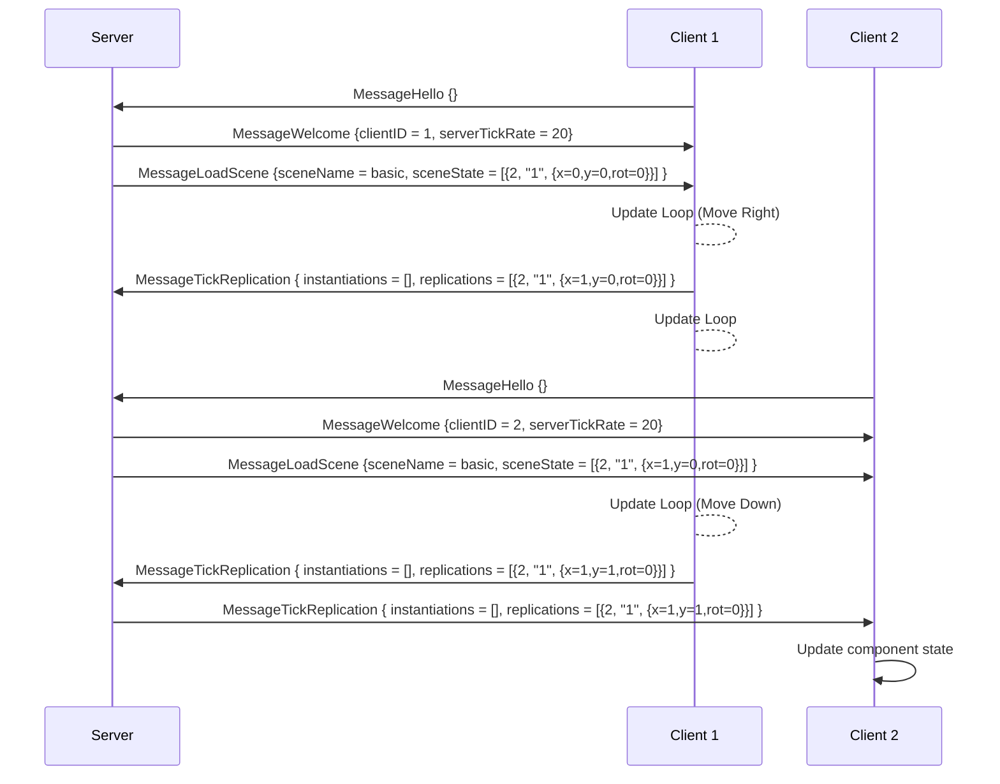

```mermaid
sequenceDiagram
    participant S as Server
    participant C1 as Client 1
    participant C2 as Client 2

    C1 ->> S : MessageHello {}
    S ->> C1 : MessageWelcome {clientID = 1, serverTickRate = 20}
    S ->> C1 : MessageLoadScene {sceneName = basic, sceneState = [{2, "1", {x=0,y=0,rot=0}}] }
    C1 --> C1 : Update Loop (Move Right)
    C1 ->> S : MessageTickReplication { instantiations = [], replications = [{2, "1", {x=1,y=0,rot=0}}] }
    C1 --> C1 : Update Loop
    C2 ->> S : MessageHello {}
    S ->> C2 : MessageWelcome {clientID = 2, serverTickRate = 20}
    S ->> C2 : MessageLoadScene {sceneName = basic, sceneState = [{2, "1", {x=1,y=0,rot=0}}] }
    C1 --> C1 : Update Loop (Move Down)
    C1 ->> S : MessageTickReplication { instantiations = [], replications = [{2, "1", {x=1,y=1,rot=0}}] }
    S ->> C2 : MessageTickReplication { instantiations = [], replications = [{2, "1", {x=1,y=1,rot=0}}] }
    C2 ->> C2 : Update component state

```
